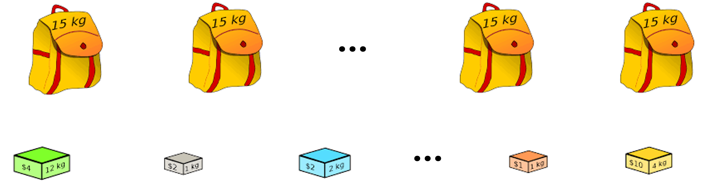
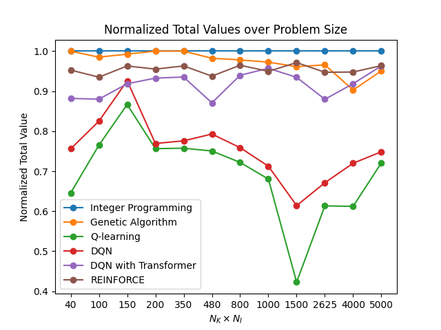
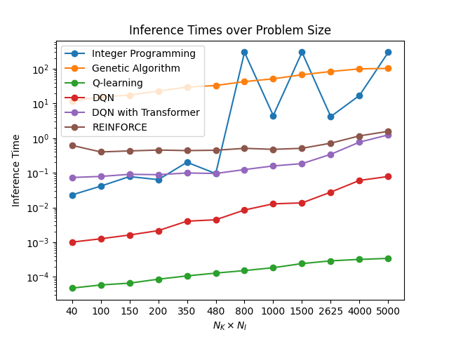
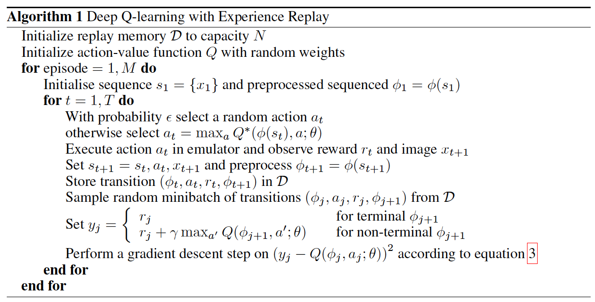
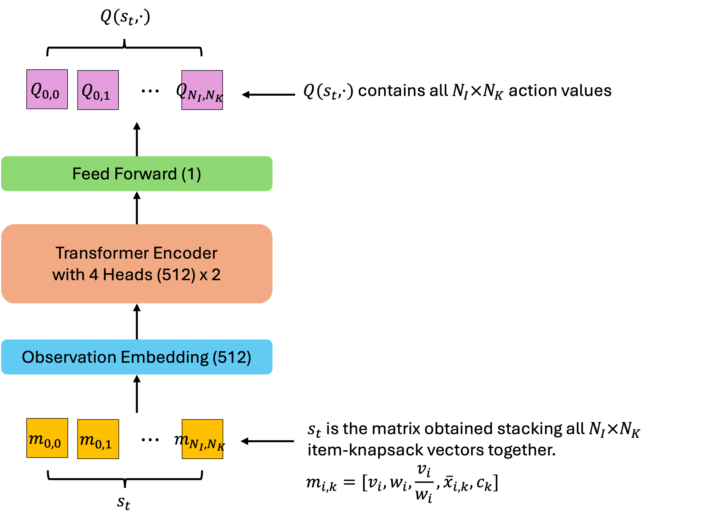
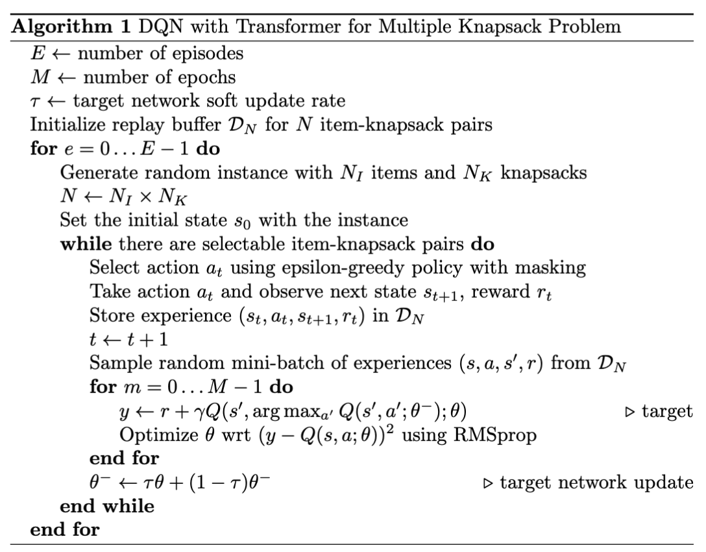
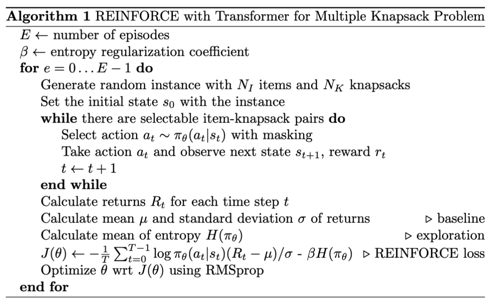

# Multiple Knapsack

Optimize multiple knapsack problem using reinforcement learning. It's one of the most popular problems in combinatorial optimization. 

Specifically, there are $N_I$ items and $N_K$ multiple knapsacks not only one knapsack. Each item has a value $v_i$ and a weight $w_i$, and each knapsack has a capacity $c_k$. The goal is to maximize the total value of the items in the knapsacks without exceeding the capacity of each knapsack. 



It's defined as mathematical optimization formulation:

$$
\begin{align*}
\text{maximize} \quad & \sum_{i=1}^{N_I}\sum_{k=1}^{N_K} v_i x_{i,k} \\
\text{subject to} \quad & \sum_{i=1}^{N_I} w_i x_{i,k} \leq c_k, \quad \forall k = 1, \ldots, N_K \\
& \sum_{k=1}^{N_K} x_{i,k} \leq 1, \quad \forall i = 1, \ldots, N_I \\
& x_{i,k} \in \{0, 1\}, \quad \forall i = 1, \ldots, N_I, \quad \forall k = 1, \ldots, N_K
\end{align*}
$$

where $x_{i,k}$ is a binary variable that indicates whether the item $i$ is in the knapsack $k$ or not.

We show total values normalized by the optimal value and inference times for each problem size in the below figures:

| Total Values | Inference Times |
| :---: | :---: |
|  |  |

Since "DQN with Transformer" and "REINFORCE" methods are trained on multiple problem instances, they can be evaluated on various problem sizes. In other words, they can solve any problem size using just one trained model. On the other hand, other methods must optimize each problem instance separately.

| [Setup](#setup) | [Run](#run) | [Results](#results) | [Methods](#methods) |

## Setup

Create Python 3.9 environment and activate it:

```bash
conda create -n multi-knapsack python=3.9 -y
conda activate multi-knapsack
```

Install the required packages:

```bash
pip install torch==2.3.0
pip install matplotlib==3.8.4
pip install pandas==2.2.2
pip install PuLP==2.8.0
```

## Run

First of all, you should generate a multiple knapsack problem using the following command:

```bash
python generate_problem.py [PROBLEM_NAME] [NUM_KNAPSACKS] [NUM_ITEMS]
```

where `[PROBLEM_NAME]` is the name of the problem, `[NUM_KNAPSACKS]` is the number of knapsacks, and `[NUM_ITEMS]` is the number of items. Then, you can see the generated problem in the `problems/[PROBLEM_NAME]` directory. Specifically, there are two csv files generated: `knapsacks.csv` and `items.csv`. See details in the `generate_problem.py` file.

You can train the below methods using the following command:

| Method | Command | Multiple Instances | Inference | 
| --- | --- | --- | --- |
| [Integer Programming](#integer-programming) | `python ip.py [PROBLEM_NAME]` | ❌  | Immediate |
| [Genetic Algorithm](#genetic-algorithm) | `python ga.py [PROBLEM_NAME]` | ❌  | Immediate |
| [Q-learning](#q-learning) | `python qlearning.py [PROBLEM_NAME]` | ❌  | Immediate |
| [DQN](#dqn) | `python dqn.py [PROBLEM_NAME]` | ❌  | `--inference` or `-i` |
| [DQN with Transformer](#dqn-with-transformer) | `python dqn_transformer.py` | ✅ | `--inference` or `-i` |
| [REINFORCE](#reinforce) | `python reinforce.py` | ✅ | `--inference` or `-i` |

where `[PROBLEM_NAME]` is the name of the problem. If you want to evaluate the trained model, you should add the `--inference [PROBLEM_NAME]` or `-i [PROBLEM_NAME]` option. See detail hyperparameters in each python file.

> Note: "DQN with Transformer" requires huge memory due to the replay buffer for each problem size. If you have a memory issue, you can reduce the replay buffer size using `--replay_buffer_max_size` option.

## Results

If you optimize the problems using the above methods, you can see the results in the `results` directory. Specifically, there are `results/train` and `results/inference` directories. The former contains the results of the training process, and the latter contains the results of the evaluation process. 

Train results:

* `results/train/[METHOD]/[PROBLEM_NAME]`: Method that can be trained on only one specific problem instance.
* `results/train/[METHOD]`: Method that can be trained on multiple problem instances.

Inference results:

* `results/inference/[PROBLEM_NAME]`

For example, if you optimize the problem named `example` using "Q-learning" method, you can see the training results in the `results/train/qlearning/example` directory and the inference results in the `results/inference/example` directory. Meanwhile, if you train "DQN with Transformer" method, you can see the training results in the `results/train/dqn_transformer` directory. If you evaluate the trained method on the problem named `example`, you can see the inference results in the `results/inference/example` directory.

The most important file is `results.csv` in `results/inference/[PROBLEM_NAME]` directory. It contains the summary of the results. The csv table is like this:

| method | total_value | episodes | train_time | inference_time | optimal |
| --- | --- | --- | --- | --- | --- |
| Integer Programming | 1132 | | 17.099641799926758 | 17.099641799926758 | True |
| Genetic Algorithm | 1022 | | 99.37010979652403 | 99.37010979652403 | |
| Q-learning | 693 | 100000.0 | 129.4867742061615 | 0.0003199577331542 | |
| DQN | 815 | 500.0 | 703.8091475963593 | 0.0605506896972656 | |
| DQN with Transformer | 1040 | 900.0 | 26091.23874163628 | 0.769263744354248 | |
| REINFORCE | 1073 | 50000.0 | 25081.34827184677 | 1.165057897567749 | |

You can compare and visualize the results using the following command:

```bash
python summary.py [PROBLEM_NAMES...]
```

where `[PROBLEM_NAMES...]` is the names of the problems. For example, if you want to compare the results of the problems named `example1` and `example2`, you can use the following command: `$ python summary.py example1 example2`. Also, you can compare the results of all problems if you don't specify any problem: `$ python summary.py`. The results are saved in the `results/summary` directory.

## Methods

In this section, we describe the methods used in detail.

### Integer Programming

Integer programming is a method that solves the multiple knapsack problem using the PuLP library. It's a brute-force method that finds the optimal solution. It's not scalable because it can't optimize multiple problem instances.

### Genetic Algorithm

TODO

### Q-learning

Q-learning is a model-free conventional reinforcement learning algorithm that learns the optimal policy by interacting with the environment. Since it's a tabular method, if the problem size is large, it's not scalable.

We define the Markov decision process (MDP) as follows:

* State: $s_t = i$ is the current item $i$
* Action: $a_t = 0$ is not selecting the item, $a_t = k$ is selecting the item for the knapsack $k$
* Reward: $r_t = v_i$ if $a = k$ and $w_i \leq c_k$, $r_t = -v_i/2$ if $a = k$ and $w_i > c_k$, otherwise $r_t = 0$
  
This approach can reduce to the low dimensionality of the state space. However, it has a sub-optimality issue.

The Q-table is represented by $Q(s,a) \in \mathbb{R}^{N_I \times (N_K + 1)}$. The Q-value is updated by the following rule:

$$
Q(s_t, a_t) \leftarrow Q(s_t, a_t) + \alpha \left( r_t + \gamma \max_{a} Q(s_{t+1}, a) - Q(s_t, a_t) \right)
$$

where $\alpha$ is the learning rate and $\gamma$ is the discount factor.

### DQN

Deep Q-Network (DQN) is a model-free deep reinforcement learning algorithm that learns the optimal policy by interacting with the environment. It's similar to Q-learning, but it utilizes a neural network to approximate the Q-value function. We define the Markov decision process (MDP) as follows:

* State: $s_t = [v_i,w_i,c_k,\bar{x}_{i,k}] \quad \forall i,k$
* Action: $a_t = x_{i,k}$ is selecting the item $i$ for the knapsack $k$
* Reward: $r_t = v_i$

where $\bar{x}_{i,k}$ is the binary variable that indicates whether the item $i$ can be selected for the knapsack $k$ or not. If $\bar{x}_{i,k} = 0$ in the state $s_t$, the item-knapsack pair is masked when selecting the action $a_t$.

We've implemented the Vanilla DQN algorithm (Image source: [Playing Atari with Deep Reinforcement Learning](https://arxiv.org/abs/1312.5602).):



### DQN with Transformer

DQN with Transformer utilizes the Transformer architecture to solve the multiple knapsack problem. We define the Markov decision process (MDP) as follows:

* State: $s_t$ is the matrix obtained by stacking all item-knapsack feature vectors $[v_i,w_i,v_i/w_i,\bar{x}_{i,k},c_k]$
* Action: $a_t = x_{i,k}$ is selecting the item $i$ for the knapsack $k$
* Reward: $r_t = v_i$

where the sequence length of the state $s_t$ is $N_I \times N_K$ and can be varing.

Transformer can process the varing sequence length, so it can be trained on multiple problem instances. Also, Transformer is permutation-invariant so that item-knapsack pairs' order doesn't matter. The Transformer Q network architecture is as follows:



We've implemented the DQN with Transformer algorithm for multiple knapsack problem, which is inspired from the paper [Reinforcement Learning for the Knapsack Problem](https://link.springer.com/chapter/10.1007/978-3-030-86286-2_1):



### REINFORCE

REINFORCE is a model-free policy gradient reinforcement learning algorithm. It's a policy-based method that directly optimizes the policy. We define the Markov decision process (MDP) same as DQN with Transformer. Also, it utilizes the Transformer architecture. The Transformer policy network architecture is similar to the Transformer Q network and is as follows:


We've implemented the REINFORCE algorithm:



## References

[1] Sutton, Richard S., and Andrew G. Barto. Reinforcement learning: An introduction. MIT press, 2018.  
[2] Mnih, Volodymyr, et al. "[Playing atari with deep reinforcement learning](https://arxiv.org/abs/1312.5602)." arXiv preprint arXiv:1312.5602 (2013).  
[3] Pierotti, Jacopo, et al. "[Reinforcement Learning for the Knapsack Problem](https://link.springer.com/chapter/10.1007/978-3-030-86286-2_1)." Optimization and Data Science: Trends and Applications: 5th AIROYoung Workshop and AIRO PhD School 2021 Joint Event. Springer International Publishing, 2021.  